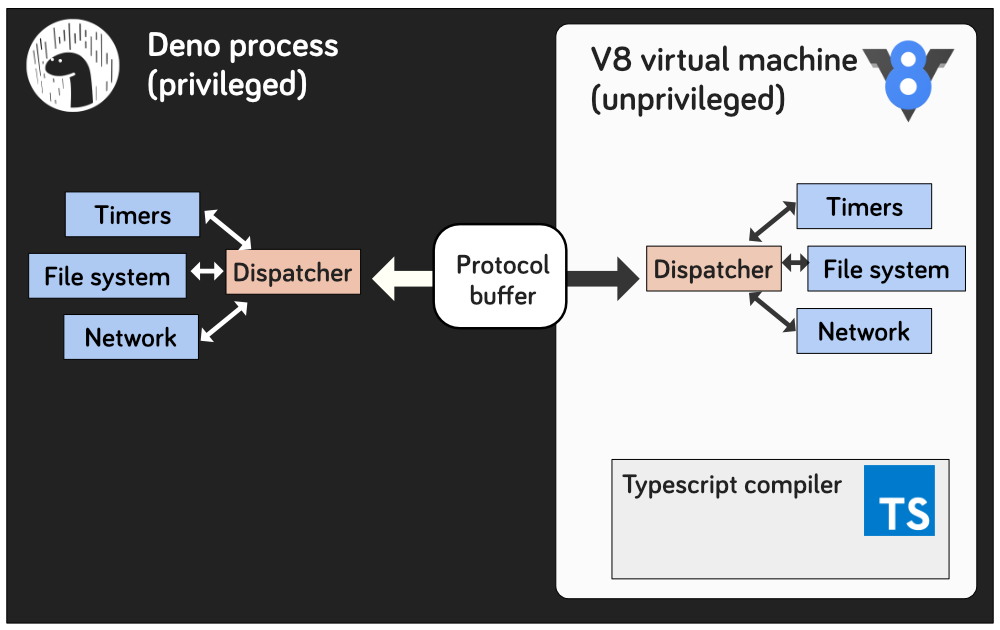

# Deno-playground

This is a collection of random Deno things originally presented at LNUG in October 2019. Likely to be expanded as I mess around with it more.

## What the flip is Deno...?

"A secure runtime for JavaScript and TypeScript built with V8, Rust, and Tokio"

That's how Ryan Dahl (@ry) describes it, it fixes some of the problems with Node, pulling it back towards the browser in a bunch of ways and making it more declarative (less magic), more secure and a bunch other things.

This fantastic video talks through Ryan's reasoning and aims for Deno... it's great

https://youtube.com/watch?v=M3BM9TB-8yA


## Getting started

You can install Deno with a package manager

**With [Scoop](https://scoop.sh):**

```powershell
scoop install deno
```

**With [Homebrew](https://brew.sh/):**

```sh
brew install deno
```

If you want to do it some other way the [deno-install](https://github.com/denoland/deno_install) repo has a bunch of options for you


## 👋 Obligatory hello world example

`deno run helloWorld.ts`

You'll see the compile step run (if you rerun the same code it won't need to compile again because their are no changes - neat)

Boom, you've just run your first thing in Deno. It wasn't that exciting... right? Patience!

&nbsp;
&nbsp;
&nbsp;
&nbsp;

## 📦 Imports and packages

Importing code from other files and installing and using eternal packages is an obvious requirement for any runtime - Deno does this in a very different way to how Node did.

Ryan notes that theres a couple of odd things about Node does things. Firstly the fact that I can just `require('./thing')` and node will assume you're looking for a Javascript file
is just not explicit (for no good reason). It also means that the file resolution has to do way more work than it needs to (and I looking to import `thing/index.js` or `./thing.js`). It's also not how
the browser (i.e. JavaScript) works.

Similarly `index.js` is weird, again it over complicates the module resolution algorithm and is declarative. Ryan points out that it's basically there because they thought it was a cute match with index.html.

One of Ryan's other regrets is `package.json` - it made npm (a privately controlled package repository) a thing which is... not really ok. It's become needlessly bloated with other things (hands up who puts their jest and eslint in their package file? You're a monster).
It's another unnecessary abstraction that isn't Javascript... (can you see a pattern emerging here?)

If you look at `modules.ts` you'll see two import statements,
One local one remote:

```
import { doTheThing } from './utils/index.ts'
import Spinner from 'https://deno.land/x/cli_spinners/mod.ts';
```

The local one needs a file extension otherwise it won't resolve correctly.
The remote one points to a path, the url defines the version.... theres no need for a list of dependencies - neat!

Running:

`deno run modules.ts`

You'll see the cli_spinners file be downloaded (as well as the files it requires), compilation and then the program will run.
The packages from the web are cached indefinitely locally so theres no need to re-download them (although theres a flag, `--reload` you can pass for re-fetching).

&nbsp;
&nbsp;
&nbsp;
&nbsp;

## 🔐 Security

&nbsp;
&nbsp;

### 🗂 File system

So here is where it gets really interesting. By default node give the V8 engine access to loads of aspects of your system, binding a bunch of system calls into v8.
Which is kind of super useful but... you know, super insecure. V8 is a beautiful sandboxed environment and Node undoes all of that.

If you run:

```
deno run security/fileWrite.ts
```

You'll get an interesting message:


The code compiles and then, before running, asks for permissions to a specific part of the file system. Secure by default is a good way to be!
We have a bunch of options but... this would be really annoying on a CI box so theres another way!


```
deno run --allow-write='./hello.txt' security/fileWrite.ts
```

This runs the process with that permission set. You can also use the `--allow-write` flat to allow access to all write permissions.

What's also interesting here (in my opinion) is the way `writeFile` works. In node you'd import `fs` and do `fs.writeFile()`. Now this is fine but... it looks like JavaScript and... well it isn't. It's node.
Deno's `Deno.writeFile()` is a really nice (possibly completely unintentional) way of calling out the line between JavaScript and Deno which... feels nice.

&nbsp;
&nbsp;

### 🕸 Network

The same kind of thing exists for network access, `http.ts` contains a pretty boring example. But running it with:

`deno run http.ts`

we get another security message about allowing permission to `0.0.0.0:8080`. Again we can allow this with a flag:

`deno run --allow-net='0.0.0.0:8080' http.ts`


Theres a bunch of different allow flags we can use:

```
--allow-all                    Allow all permissions
--allow-env                    Allow environment access
--allow-hrtime                 Allow high resolution time measurement
--allow-net=<allow-net>        Allow network access
--allow-read=<allow-read>      Allow file system read access
--allow-run                    Allow running subprocesses
--allow-write=<allow-write>    Allow file system write access
```

The Deno api also includes methods for processes to de-escalate their own privileges (not to escalate them though!), which is a nice touch.
I can see utility in needing a bunch of permissions at boot but never again, being able to roll those back feels super clean.

There are still hanging questions, how do I manage complex permissions without just allowing loads of things and how do I make those easily portable. I guess we'll find out!

#### How does Deno do this?

The Deno process is privileged, it can make system calls, the v8 vm it runs though is not, it can only communicate with the system via the Deno (using a protocolBuffer).



You can read more about protocol buffers [here](https://developers.google.com/protocol-buffers) but they're essentially a neat way of serializing structured data in a neat, efficient way.


&nbsp;
&nbsp;
&nbsp;
&nbsp;

## 💻 Http

So... I think it's safe to say that lots of Node.js is used to run web servers so lets look at how we can do that in Deno. Node packages won't work with Deno so... there is unsurprisingly a slew of
frameworks popping up for Deno that look a lot like Koa, Express and even Sinatra. We'll use one of this, Pogo, to spin up a basic server.

In `http/basic.ts` we import Pogo and some helper functions and define a simple GET and POST endpoint (that... counts words for some reason. No idea why I chose that ¯\\\_(ツ)_/¯).
If we run it:

```
deno  run --allow-net='0.0.0.0:8080' http/basic.ts
```

We can hit both endpoints and... it works 🎉. Is it slow to start? Yeah. Is it efficient? probably not but... it works!

So what else can we do...

`http/reactTest.tsx` spins up a web server and uses ReactDOMServer to render a react component to an HTML string and... serve it up.

Eagle eyed readers might say 'But Hew... you said that Node packages won't work with Deno and you're using ReactDOMServer which is a node package... what the hello'.

Well, it's like this see...

Deno is using a version of V8 (7.9.218 at the time of writing, which is actually ahead of what Chrome is using at the moment) that supports dynamic import (like chrome, safari and firefox do) so ReactDOMServer isn't Node it's actually browser-compatible JavaScript. If I open chrome devtools:


Which again is a nice example of Deno making a JavaScript runtime that is way closer to the browser. So we can use straight JavaScript packages, just not anything that uses anything Node specific.

Ryan Dahl is quite open about not caring or wanting to back support Node, his view is if Deno tries to do that they'll just build Node again which... you know. Fair.


&nbsp;
&nbsp;
&nbsp;
&nbsp;


## Erm...


So what's the point in looking at an extremely early stage, not at all production ready Javascript runtime when Node 12 has just entered LTS and Node 13 has just been released? Well... for me it's a dollop of nosiness.
I recently looked back and the first line of Javascript I ever wrote, in 2009, was Node, I've totally come to just take a load of things about it for granted (I totally exploit how index.js works and the fuzzy import statement 
to be lazy). The added declarativeness about Deno I really like (I hate when 'magic' happens in code... I don't really want to have to remember all that stuff).

I'm intrigued to see where it goes, I'm super interested to follow the progress and peek in at the architectural decisions are made - I'm probably not ever going to build a Javascript runtime but the decisions people make (and the reasons behind it) are always super interesting (and Ryan knows what he's doing).

Theres also tonnes of opportunity to contribute, both to Deno and to the growing library of packages available for it (which is COOL).


### What's next for Deno?

Well releases are coming thick and fast, theres been two big releases in October adding a bunch of features as well as fixing some bugs. They're working on building linting, testing and debugging into Deno.


### Where can I find out more?

You can check out [deno.land](https://deno.land) to learn more. And the [deno Github repo](https://github.com/denoland/deno) to have a look into issues and PRs.

Theres also the (slightly inevitable) (Awesome Deno)[https://github.com/denolib/awesome-deno] repo on github with a growing list of libraries, examples and tutorial.... how GOOD!

Deno also has this cute-ass mascot so... their is that


